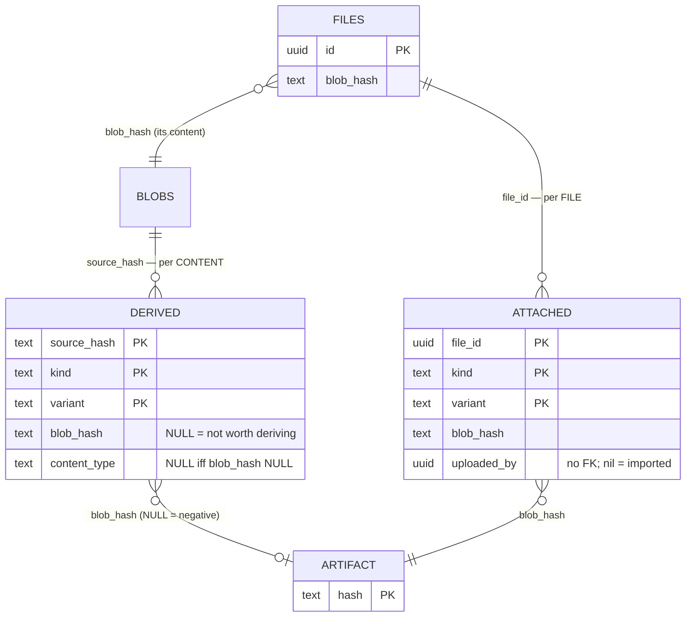

# Derived and attached blobs

Two tables hang small artifacts off the blob store: thumbnails,
transcodes, uploaded previews. They look almost identical, and the
difference between them is a security boundary rather than a style
choice.

("Satellite tables" is the shorthand used in the code and in
`satellites_consistency`, the job that walks both. It is a useful
collective noun once you know what it covers; this page is what it
covers.)

- **`storage.content_derived_blobs`** — things the *server derived from
  file content*. Keyed by the BLAKE3 of the source.
- **`storage.file_attached_blobs`** — things a *user attached to one
  specific file*. Keyed by `file_id`.

Both point into the same blob store underneath (see
[Backend Storage](./backend-storage.md)). The keying is what separates
them.



Read the two arrows into `ARTIFACT`: `DERIVED` reaches it from
**content**, `ATTACHED` from a **file**. Everything below follows from
that.

## Why two tables and not one with a `kind` column

Content keying means identical bytes share one derivation. Upload the
same photo twice and the server renders its thumbnail **once** — both
files resolve to the same `source_hash`, find the same row, and serve
the same blob. That is the entire point for server-derived artifacts:
the derivation is a pure function of the content, so sharing it is
free and correct.

Apply the same keying to *user-supplied* bytes and it becomes an
attack. If uploaded previews were content-keyed, uploading a file whose
content matches someone else's would let you replace the preview they
see — or read yours in place of theirs. The preview is not derived from
the content; it is an assertion *about* a file, made by whoever uploaded
it, and two people can hold different assertions about identical bytes.

A single table with a `kind` discriminator could not express this. The
key would have to be one thing or the other, and either choice is wrong
for half the rows. The split is the enforcement mechanism, not a
filing convenience — which is why `thumb_derived_import` explicitly
refuses `ext-` filenames and `thumb_attached_import` explicitly refuses
hash-named ones, rather than one job handling both trees.

## `storage.content_derived_blobs`

| column | type | notes |
|---|---|---|
| `source_hash` | `VARCHAR(64)` | PK. BLAKE3 of the **source** content. Dependent reference — holds no refcount; the row is reaped with its source. |
| `kind` | `TEXT` | PK. `thumbnail` \| `transcode` (CHECK-constrained). |
| `variant` | `TEXT` | PK. Opaque rendering discriminator — see [Variant](#variant-holds-every-axis-that-can-vary). |
| `blob_hash` | `VARCHAR(64)` | The derived artifact, **or NULL** — see [Negative rows](#negative-rows). Reference **holder** when present. |
| `content_type` | `TEXT` | MIME of the artifact. NULL exactly when `blob_hash` is NULL. |
| `created_at` | `TIMESTAMPTZ` | |

A CHECK keeps `blob_hash` and `content_type` NULL together: a type
without bytes describes nothing, and bytes without a type cannot be
served.

## `storage.file_attached_blobs`

| column | type | notes |
|---|---|---|
| `file_id` | `UUID` | PK. FK to `storage.files` **ON DELETE CASCADE**. |
| `kind` | `TEXT` | PK. `preview` \| `subtitle` \| `cover_art` (CHECK-constrained). |
| `variant` | `TEXT` | PK. |
| `blob_hash` | `VARCHAR(64)` | `NOT NULL` — there is no negative case here. |
| `content_type` | `TEXT` | `NOT NULL`. |
| `uploaded_by` | `UUID` | `NOT NULL`, and deliberately **no FK**. |
| `created_at` | `TIMESTAMPTZ` | |

`uploaded_by` follows the provenance convention: an FK with
`ON DELETE SET NULL` would erase the audit trail exactly when it matters
most, and without an `ON DELETE` clause it would block deleting a user
at all. Deleting the uploader must not rewrite history, so the id is
kept even once it no longer resolves. Rows created by the migration
carry the all-zeros sentinel — "imported, uploader unknown" — rather
than a fabricated owner such as the file's `created_by`, which could
later be misread as evidence that someone replaced a preview.

## Negative rows

`content_derived_blobs.blob_hash` is nullable, and a NULL row means:
**this derivation was attempted and is known not to be worth storing
for this content.**

The case that motivated it: `ImageTranscodeService` can only discover
that WebP comes out *larger* than the original by doing the full decode
and re-encode. Without a record, every request repeats that work to
throw the result away. The same applies to a source that cannot be
decoded, or one over the decode ceiling.

Only failures **deterministic in the content** may be recorded. A
timeout, a closed semaphore, an I/O error reading the source are
properties of the moment, not the bytes; persisting one marks a
perfectly good image as underivable forever, with nothing to retry it.
The asymmetry sets the default — a wrongly-cached transient is silent
and permanent, a missing negative merely costs repeated work — so **when
in doubt, do not write the row.**

A sentinel hash was considered and rejected: it would stop `blob_hash`
naming a real blob, and every consumer joining on it would need to learn
the exception or silently mishandle it. NULL is already SQL's way of
saying "no blob", and joins drop it naturally.

`file_attached_blobs` has no negative case. There is nothing to attempt
— the bytes either arrived from a client or they did not.

### The NULL trap

This has caused two bugs, both found before shipping, and it will cause
more. SQL comparison against NULL yields NULL, so:

```sql
EXISTS (SELECT 1 FROM storage.blobs b WHERE b.hash = d.blob_hash)
```

is **false** for every negative row. Whether that is right depends
entirely on what you are asking:

- **Refcounts — correct.** A negative row holds no reference, so it must
  not contribute. `content_derived_ref_sql` relies on exactly this.
- **Dangling checks — wrong.** `satellites_consistency` reported every
  negative row as `derived_dangling_blob` at `data_loss` severity: a row
  correctly pointing at nothing, reported as an artifact that had gone
  missing. It needs `d.blob_hash IS NULL OR <exists>`.
- **Enumeration — wrong, and it fails loudly.**
  `list_referenced_blobs` decodes `blob_hash` into `String`; the first
  NULL takes the whole sweep down. It needs `WHERE blob_hash IS NOT NULL`.

Anything joining on `blob_hash` has to decide which of these it is.

## `variant` holds every axis that can vary

`variant` is an opaque discriminator, and the schema states the rule:
new axes go **inside this string, never into new columns**.

The two tables therefore look asymmetric, and correctly so:

| table | variant | why |
|---|---|---|
| `content_derived_blobs` | `icon.webp`, `preview.jpg` | size **and** format |
| `file_attached_blobs` | `icon` | size only |

A single source legitimately has two thumbnails at one size — WebP for
capable clients, JPEG for the rest — and since the PK is
`(source_hash, kind, variant)`, the format must be inside `variant` or
those rows collide and only one can exist. Uploaded previews have no
format axis: `store_external_thumbnail` re-encodes to JPEG on write, so
`image/jpeg` is a constant and `.jpg` in every variant would carry no
information.

**Rejected alternative: key on `content_type` instead.** Making
`content_type` part of the key would express the same thing, and it was
reasonable until negative rows landed. It is now foreclosed —
`content_type` must be nullable for negative rows, and PostgreSQL does
not allow a nullable column in a primary key. A UNIQUE constraint would
not rescue it either: NULLs compare as *distinct* in a unique index, so
duplicate negative rows for one `(source_hash, kind, variant)` would
become possible, and that row's singularity is what the mechanism
depends on. Two softer objections stand regardless — `content_type` is a
presentation value, and MIME strings are not canonical (`image/jpg` and
`image/jpeg` name one format).

**If the assumption changes**, the migration has a known shape.
`20261022000000_derived_variant_encodes_format.sql` did it once for the
derived table: append the format to existing variants, update the
callsites that build the string. Nothing is lost in the meantime —
`content_type` records the real format — it simply is not part of the
key, so two formats cannot coexist until it is.

## Worked examples

**The same image uploaded twice.** Two `storage.files` rows, one
`blob_hash` between them, **one** `content_derived_blobs` row per
`(kind, variant)`, one thumbnail blob. The second upload renders
nothing; it finds the existing row. Copying either file adds no row at
all — the copy shares the source hash, so it resolves to the same
derivation.

**A PDF with a client-uploaded preview.** One `file_attached_blobs` row
keyed by that `file_id`. Copy the file and the row is **duplicated** for
the new id (`storage.copy_file_satellites`), because the preview belongs
to the file, not to the content. Without that duplication the copy
silently loses its preview — and a PDF has no server-side render path,
so nothing regenerates it.

**A screenshot WebP cannot shrink.** One row, `blob_hash` and
`content_type` both NULL. A reader concludes: the transcode was
attempted, it is known not to help *for this content*, serve the
original and do not retry. Every file sharing those bytes inherits the
verdict.

**One source, thumbnailed and transcoded.** Two rows, same
`source_hash`, `kind` of `thumbnail` and `transcode`. Add a JPEG
fallback thumbnail and it is a third row, differing only in `variant`
(`icon.webp` vs `icon.jpg`).

## Lifecycle

**References.** A positive `blob_hash` is a reference *holder* — it
bumps `chunk_manifests.ref_count` through `DedupService::add_reference`,
so `dedup_gc` cannot reap an artifact a satellite still points at. A
negative row holds none. `source_hash` is a *dependent* reference and
holds nothing.

**Reaping.** Derived rows are removed by `purge_derived_blobs` when
their source blob is reaped. Attached rows vanish by
`ON DELETE CASCADE` when their file is deleted — which happens **inside
the database**, where the Rust lifecycle hooks cannot observe it, so
`trg_file_attached_blobs_decrement_blob_ref` releases the blob reference
on `DELETE`. The trigger fires on DELETE only; replacing a preview
updates `blob_hash` in place and the Rust path handles that reference
swap.

**Writing a derived row requires its source to exist.**
`store_derived_blob` guards the insert with an `EXISTS` on
`chunk_manifests`/`blobs`. Without it, a row written just after its
source was reaped would pin its artifact forever: nothing would ever
reap that `source_hash` again, so `purge_derived_blobs` could never
fire. That is not hypothetical — it shipped once, as a permanent blob
leak.

**Consistency coverage.** `satellites_consistency` is the only job that
walks these tables, and it exists because of a gap the others cannot
close: a satellite row whose *source* is gone breaks no invariant any
other check looks at. The reference is valid, the refcount is correct,
the bytes are present — every Blob-centric job agrees the system is
healthy while the artifact is pinned forever. Blob-side integrity
(missing bytes, orphans, bit-rot) belongs to `backend_consistency`;
refcount arithmetic to `blobs_consistency` and
`manifests_consistency`.

## Adding a third artifact type

Ask one question first: **is it derived from the content, or asserted
about a file?**

Derived from content — a waveform, an extracted page count, an OCR
layer — goes in `content_derived_blobs` under a new `kind`, and shares
across identical content for free.

Supplied by a user — a custom cover image, a hand-authored subtitle
track — goes in `file_attached_blobs`, and must be duplicated on copy
rather than shared.

Getting that backwards is not a performance mistake. Putting
user-supplied bytes in the content-keyed table means one user's upload
is served to everyone whose file happens to match.
