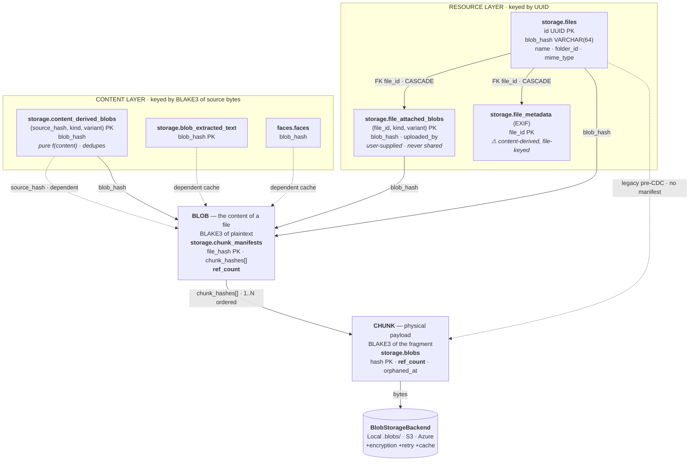

# Plan — Derived content as blobs (tier-2 refactor)

**Status:** design captured 2026-08-02, revised 2026-08-16 — keying
rule, CDC reuse, backend-dispatch rule, the
`content_derived_blobs` / `file_attached_blobs` pair, copy/version
semantics, a consistency coverage matrix with **three** hard
prerequisites (one of them a `dedup_gc` predicate that would delete
the entire derived tier), migration of the existing sidecar content,
and a schema trim down to the columns that carry information nothing
else owns. Not implemented.

Follow-up to `fix/services-use-blob-abstraction` — that
PR normalised the **read-side** (services consume blobs through
`BlobStorageBackend` uniformly). This plan tackles the **write-side**:
services that today write derived artifacts (thumbnails, transcodes)
to a local sidecar directory and would benefit from writing them
through the backend abstraction instead.

## Context — the three-tier storage taxonomy

Today the codebase runs three implicit tiers with no explicit
separation:

| Tier | Purpose | Loss on reboot? | Where today |
|---|---|---|---|
| **1 — Temp** | Pure scratch, deletable at reboot | ✅ fine | `std::env::temp_dir()` (ad-hoc callers). Now unified under `OXICLOUD_TEMP_DIR` (`AppConfig::temp_dir`). |
| **2 — Persistent spool** | Caches; expensive but rebuildable | ⚠️ possible but painful | `<storage_path>/.thumbnails/`, `<storage_path>/.transcoded/`, `<storage_path>/.blob-cache/`, `<storage_path>/.search-index/`, `<storage_path>/.plugin-logs/` — all mixed into tier-3 storage today. |
| **3 — Persistent data** | Source of truth | ❌ never | `<storage_path>/.blobs/` (Local) OR S3/Azure bucket, via `BlobStorageBackend`. Already correctly configured via `OXICLOUD_STORAGE_ENTRIES`. |

**Today's misclassification**: tier-2 sidecars live under
`<storage_path>` — the same directory as tier-3 source-of-truth
data. Ops resizing / moving / backing up tier-3 accidentally moves
tier-2 caches with it. Loss of tier 2 is expensive (regenerate
thumbnails for every photo) but not data loss; conflating them
means backup policies can't distinguish "must preserve" from "can
rebuild".

## The relation map (after this refactor)

Solid arrows **hold a reference** (bump a `ref_count`); dashed arrows
are **dependents** — they must be cleaned up when their target dies but
they keep nothing alive.



Three things to read off it:

1. **`content_derived_blobs` touches the Blob layer twice with
   opposite meanings** — `source_hash` is a dependent (it keeps
   nothing alive; the file does), `blob_hash` is a reference holder.
   Conflating them is how you get either a leak or a premature reap.
2. **Every new solid arrow into the Blob layer feeds
   `chunk_manifests.ref_count`** — the counter nothing reconciles
   today. See the prerequisites below.
3. **The two new tables meet the rest of the graph only at the Blob
   layer.** `content_derived_blobs` has no edge to `storage.files` at
   all: it reaches a file only by sharing that file's `blob_hash`.
   That is exactly what makes it dedupe across files — and exactly why
   it must never hold user-chosen bytes.

## Multi-instance driver

Single-instance: tier-2-as-local-cache works fine. Rebuild after
reboot is annoying but bounded.

Multi-instance (2+ app servers behind a load balancer):

- Request for thumbnail `abc123.jpg` lands on instance A → generates
  it → stores locally at `.thumbnails/abc123.jpg`.
- Same-URL retry lands on instance B → cache miss → regenerates
  from source.
- Every derived asset gets recomputed N times (N = instance count)
  at worst.

Wasteful compute, wasteful storage, inconsistent latency. The
long-term fix is to put derived content on tier 3 (shared) with a
local read-through cache in front. Multi-instance isn't the near-
term target, but the design should leave the door open.

## Design decision — derived content IS a blob

The blob storage abstraction is already:

- Backend-agnostic (Local / S3 / Azure)
- Encrypted uniformly (`EncryptedBlobBackend` wrapper)
- Consistency-checked (`blobs_consistency`)
- Migratable (`backend_migration`)
- Rotatable (`backend_rotate`)
- Multi-instance-ready (S3/Azure natively; Local via network mount)

Reusing it for derived artifacts means no second abstraction to
build and maintain, and all the operational surface (audit,
migration, key rotation) applies to derived content by default.

### Keying — content-address only pure functions of the content

**The rule:** an artifact may be keyed by its source's content hash
**iff** it is a deterministic pure function of the source bytes.
Anything influenced by user choice must be keyed by the resource it
was attached to, never by content.

| Artifact | Function of | Content-keyable? |
|---|---|---|
| server thumbnail | `f(blob bytes, variant)` | ✅ any user uploading identical bytes derives identical output — nothing to poison |
| transcode | `f(blob bytes, target)` | ✅ |
| extracted text | `f(blob bytes)` | ✅ — `storage.blob_extracted_text` |
| face vectors | `f(blob bytes)` | ✅ — `faces.faces` |
| client-uploaded preview | `f(user's choice)` | ❌ **must be file-keyed** — `storage.file_attached_blobs`, see below |

This isn't a new pattern: `storage.blob_extracted_text` already
chose content-keying for the same reason, and the migration says so
(`migrations/20260701000000_content_search_index.sql:22-28`) —
"extraction is keyed by `blob_hash`, not by file: N copies of the
same PDF cost ONE extraction, and rename/move/copy never
re-extract." `faces.faces` is keyed on `blob_hash` too. Thumbnails
are the same class of artifact, and file-keying them would make
them the odd one out among three sibling features while costing:

- **the dedup fast path** — `ThumbnailRefreshHook::on_file_created`
  returns early when `!is_new_blob`, so 100 users uploading the same
  photo cost one render. File-keying means either N renders or a
  join back through `files.blob_hash` (content-keying
  through the back door, slower and with more code).
- **free copies and free versions** — `on_file_copied` is a no-op
  today precisely because the key is content, and future versioning
  inherits the same property. See the copy/version axes below.

For the derived side the hash is over the **produced** bytes, so:

- Two files with identical thumbnails (same variant of the same
  source → identical bytes → identical hash) share the physical
  blob. Dedup wins for free.
- Two variants of one source (256px vs 512px) produce different
  blobs. Also correct.

The variant spec lives in the referring DB row, not in the storage
key. Storage stays one keyspace; ownership stays per-service.

### Corollary — point at a file, never at a blob

Both tables in this plan exist because their content is *not* a file:
a thumbnail has no name, no folder and no place in a user's tree. When
a binary **can** be a file, make it one and point at it with a
`*_file_id` FK — `storage.files` is already a `BlobReferenceSource`,
already covered by every consistency edge, already GC-integrated, so a
file pointer costs **zero** new reference sources and zero new
consistency checks.

That is the rule that stops the next person adding a fourth
blob-referencing table. It is what `docs/plan/hidden-system.md`
applies to user avatars, backgrounds and signatures, and it extends to
owners that are not users at all —
`carddav.contacts.photo_file_id` would retire the inlined
`photo_url TEXT` on the same terms.

### Schema

```sql
CREATE TABLE storage.content_derived_blobs (
    source_hash  VARCHAR(64) NOT NULL,  -- source Blob (no FK — see below)
    kind         TEXT NOT NULL,         -- 'thumbnail' | 'transcode'
    variant      TEXT NOT NULL,         -- 'icon' | 'preview' | 'large' | '720p'
    blob_hash    VARCHAR(64) NOT NULL,  -- the DERIVED Blob
    content_type TEXT NOT NULL,         -- served directly; no byte-sniffing
    created_at   TIMESTAMPTZ NOT NULL DEFAULT now(),
    PRIMARY KEY (source_hash, kind, variant)
);
CREATE INDEX ON storage.content_derived_blobs(blob_hash);
```

**`variant` is opaque text. New axes go inside it, never into new
columns.** This is the rule that keeps the table from growing, and it
disposes of three columns earlier drafts proposed:

- **No `format` column.** WebP vs JPEG looks like a second axis, but
  only the canonical rendering is persisted (below), so there is one
  row per variant. If a format migration ever happens — AVIF is the
  plausible one — it is `variant = 'preview-avif'` beside
  `'preview'`. Data change, not a PK migration.
- **No `codec` column.** Transcoding here is a *playability
  fallback*, not bandwidth optimisation: one widely-compatible
  rendition (H.264/AAC in MP4), no negotiation, nothing to
  distinguish. `<video>` probes the codec from the container, so the
  header only owes `video/mp4`. A second codec would be
  `variant = '720p-av1'`. (HLS/DASH manifests do need declared
  codecs, but that is a segmented architecture this table doesn't
  model and would need its own structure regardless.)
- **No `renderer` / spec-version column.** It would exist to
  invalidate rows when render parameters change (400 px → 512 px,
  q82 → q85) — but such a change is global, so invalidation is
  `DELETE … WHERE kind = 'thumbnail'` with or without it. The
  `blob_extracted_text.extractor` precedent does **not** transfer:
  that column exists because extraction caches *terminal negative
  results* per blob (`'failed'`, `'unsupported'`) that must be
  retried on an extractor bump. Thumbnails never persist a failure —
  the failure path stores a zero-weight moka sentinel that evicts
  immediately. No cached negatives, nothing version-dependent.

**Only the canonical rendering is persisted to tier 3.** WebP covers
~97% of clients; persisting the JPEG fallback too would add one
object per size per source — a 50% increase in derived object count
and in the `blobs_consistency` probe cost, to serve 3% of requests.
Re-encoding JPEG from an already-decoded 400 px WebP is
sub-millisecond, so the fallback is generated on demand and held in
the moka RAM tier only. Same principle as the "persist only `large`,
derive icon/preview" option below: **tier 3 stores the canonical
rendering; everything else is derived on demand.**

**No `size` column.** The bytes are content-addressed, so their
length is an immutable fact the blob layer already owns
(`chunk_manifests.total_size` / `storage.blobs.size`, reachable via
`blob_hash`). Copying it here would create a second source of truth
for something this table has no authority to assert. Every consumer
is covered without it: `Content-Length` comes from the bytes in hand,
storage reporting joins on `blob_hash`, thumbnails are never
range-served, and `read_blob_bytes` already takes its buffer hint
from the manifest row.

`content_type` is the one thing worth storing rather than
recomputing: the handler byte-sniffs every response today
(`mime_detect::thumbnail_content_type`), and this deletes that. It is
a per-row fact the producer knows for certain. It is *not* part of
the key — identity is (source, kind, variant).

One table with a `kind` discriminator rather than separate
`storage.thumbnails` / `storage.transcodes`: `count_references`,
`list_referenced_blobs`, the GC cascade and the
`backend_consistency` walk are byte-identical between the two, so
two tables means maintaining a duplicate of that SQL — which
`AGENTS.md § Code duplication` forbids. `kind` costs one column.

**No FK on `source_hash` or `blob_hash`**, for the reason the
search-index migration already documents: a file hash resolves to
either `storage.blobs` (legacy whole blob) or
`storage.chunk_manifests` (CDC file hash), so the reference can't be
expressed as a single FK. Orphans are reclaimed by GC instead.

**No `origin` column.** The 2026-08-02 draft had
`origin = 'server_derived' | 'client_provided'` so consistency-check
severity could differ. With client previews excluded from this table
(below), every row is server-derived and the severity is uniformly
"warning, regenerable" — the column carries no information. Re-add
it only if that changes.

**Deletion is app-layer.** `on_blob_deleted(source_hash)` does
`DELETE FROM storage.content_derived_blobs WHERE source_hash = $1 RETURNING blob_hash`
then `remove_reference()` per row — a one-for-one replacement of
today's `delete_blob_thumbnails` unlink loop, no new mechanism. A raw
SQL `ON DELETE CASCADE` would drop the mapping row without
decrementing the refcount, but *not* silently: once the reference
registry exists the refcount is derivable, so the drift surfaces as a
`refcount_mismatch` finding, and the interim state is an **over**-count
(blob retained longer than needed) never an under-count (live data
reaped). So a cascade is tolerable where it's ergonomic — see
`file_attached_blobs` below — provided the registry is in place to
reconcile it.

### The pair — `content_derived_blobs` and `file_attached_blobs`

Two tables, one keying difference, and that difference *is* the
security boundary (see the client-preview section):

```
storage.content_derived_blobs  (source_hash, kind, variant)
storage.file_attached_blobs    (file_id,     kind, variant)
```

**The name states the key**, because the key is the only thing that
differs and choosing the wrong one is a silent poisoning bug rather
than a compile error. An earlier draft called these
`derived_blobs` / `attached_blobs`; that pairing was rejected because
`derived` vs `attached` is the wrong axis of symmetry — a thumbnail is,
in plain English, "attached to" a file, so both words plausibly
describe either table and the names carry no signal about keying. The
`content_` / `file_` prefixes are non-overlapping and answer the only
question an implementor needs to ask.

```sql
CREATE TABLE storage.file_attached_blobs (
    file_id      UUID NOT NULL REFERENCES storage.files(id) ON DELETE CASCADE,
    kind         TEXT NOT NULL CHECK (kind IN ('preview', 'subtitle', 'cover_art')),
    variant      TEXT NOT NULL,         -- 'preview' | 'en' | 'cover'
    blob_hash    VARCHAR(64) NOT NULL,  -- content-addressed bytes (dedup preserved)
    content_type TEXT NOT NULL,
    uploaded_by  UUID NOT NULL REFERENCES auth.users(id),
    created_at   TIMESTAMPTZ NOT NULL DEFAULT now(),
    PRIMARY KEY (file_id, kind, variant)
);
CREATE INDEX ON storage.file_attached_blobs(blob_hash);
```

Same trims as `content_derived_blobs` — no `size`, no `format`, no
`codec`. Two deliberate differences:

- **No `renderer`-style column even in principle.** These bytes
  aren't rendered, they're supplied; there is no spec to version.
  That falls straight out of the purity rule.
- **`uploaded_by` is kept.** It is the one column here that is
  genuinely new information rather than a copy of something the blob
  layer owns, and it is the only trace that an Editor on a shared
  file replaced the owner's preview — untraceable today.

**Routing rule — put this as a comment on both tables:**

> Bytes are a pure deterministic function of the file's content →
> `content_derived_blobs` (content-keyed, dedupes across files, regenerable).
> Bytes are user-supplied or user-chosen → `file_attached_blobs`
> (file-keyed, never shared across files, not regenerable).

Generic naming rather than `file_previews` because the family is
real, and each member would otherwise be a new table plus a new
`BlobReferenceSource` plus a new term in the consistency recompute.
With `kind` it's a one-line `ALTER … CHECK`:

| Kind | Why it lands here |
|---|---|
| `preview` | client-uploaded thumbnail (today's case) |
| `e2e_thumbnail` | strongest future case — in an E2E drive the server *cannot* derive thumbnails, so the client must upload them. "Vault" is already reserved as a future E2E drive kind (`project_drive_naming_and_vault_reservation`) |
| `subtitle` | user-supplied caption tracks, one per language (`variant = 'en'`) |
| `cover_art` | user override of embedded/derived art; user-chosen video poster frame |
| `metadata_sidecar` | XMP / `.nfo` uploaded alongside a photo |
| `signature` | detached signature over the file, per signer |

Avoid `file_sidecars` as a name despite it being the natural
media-world term: this codebase already uses "sidecar" for the
tier-2 local directories (see the sidecar section below), and
overloading it would undo that vocabulary.

Note the `(…, kind, variant)` shape is identical across both tables,
so one generic reference-source implementation parameterised by
table + column covers both — the same one-implementation property
the rest of this plan is built on.

**Naming and comments are advisory; the boundary needs a test.** The
one guard that actually stops a future implementor is an integration
test asserting both halves at once: two users uploading byte-identical
content resolve to the **same** `content_derived_blobs` rows (dedup
works), and a client preview uploaded by one of them produces **no**
row reachable by the other (no cross-file sharing). That test fails
loudly the moment someone rekeys either table. Ship it with step 4,
not after.

Structural help, in descending order of reliability: the test; the
column types (`file_id UUID` vs `source_hash VARCHAR(64)`, so a row
cannot be copied between tables); the absence of any `file_id` column
on `content_derived_blobs`; the table comments.

### Write path — reuse `store_from_stream`, don't special-case CDC

Derived blobs go through `DedupService::store_from_stream()`
**unchanged**. An earlier draft of this plan proposed a dedicated
single-chunk write path to avoid the manifest row; that was
optimising the wrong thing. What it costs to reuse the standard
path:

- **+1 `chunk_manifests` row per derived blob.** `CDC_MIN_CHUNK` is
  65_536, and WebP q82 thumbnails land at roughly 3–8 KB (icon),
  15–30 KB (preview), 40–90 KB (large) — so icon and preview are
  always below the minimum chunk size and emit exactly one chunk;
  `large` occasionally splits into two.
- **One manifest lookup per read**, served from RAM by
  `manifest_cached` — not a per-read query.
- **A CDC pass over ~12 KB** — below min-chunk, so a single pass
  with no boundary search. Negligible.

What it buys: zero new write path, zero new read path, and
ref-counting, GC, `add_reference` / `remove_reference` and both
consistency jobs all work on derived blobs with no changes, because
they are already manifest-aware. One `store_from_stream` call == one
reference == one `content_derived_blobs` row, symmetric on delete.

Two gotchas that come with the reuse:

1. `store_from_stream` fires `fire_blob_creation_hooks`. The only
   non-dispatcher `BlobLifecycleHook` implementor today is
   `ThumbnailService`, whose `on_blob_created` is a no-op — so no
   spurious work now. But creating a thumbnail now fires
   blob-creation hooks, so any future hook (search indexing, face
   detection) must not treat every new blob as user content. Add a
   `kind`/content-type guard to the hook contract before the second
   implementor lands.
2. GC of a *derived* blob fires `on_blob_deleted(derived_hash)`,
   which looks for derived-of-derived rows, finds none and stops.
   One level deep, terminates — but that's incidental rather than
   designed. Comment it at the recursion point.

### No backend-type branching in the service

`src/AGENTS.md` already forbids the shape this refactor must avoid:

> - **Never hand-craft blob paths.** No `blob_root: PathBuf` fields […]
> - **Persistent state = backend**, not `<storage_path>/*` sidecars.

`thumbnail_service` is cited there as a read-side reference impl,
and the read side is compliant. The write side is the violation:
`thumbnails_root: PathBuf` is exactly the banned field, and
`get_thumbnail_path()` is the hand-crafted path.

There must be **no `if backend is local { .thumbnails/… } else { blob }`
anywhere in the service.** `ThumbnailService` holds
`Arc<DedupService>`, reads and writes through it, and never learns
which backend it is sitting on. The local-vs-remote difference is
expressed once, as decorator composition in `common/di.rs`:

```rust
if self.config.storage.cache.enabled && active_backend_kind != StorageBackendType::Local {
    blob_backend = Arc::new(CachedBlobBackend::new(blob_backend, &cfg));
}
```

Local deployments write derived blobs into `<storage>/.blobs/` via
`LocalBlobBackend` with no cache decorator (a cache would be a
byte-identical second copy on the same disk). Remote deployments get
the cache. Same service code both ways — and it is the same branch
that already governs source blobs, not a new one.

What this deletes from `thumbnail_service.rs`:

- `thumbnails_root` field, `get_thumbnail_path()`,
  `ThumbnailSize::dir_name()` (becomes `variant()`, feeding the DB
  column)
- `initialize()`'s `create_dir_all` loop
- every `fs::read` / `fs::write` / `fs::metadata` / `remove_file`
- the three `all_exist` stat loops → one indexed query each
- `delete_blob_thumbnails`'s unlink loop and the duplicate of it
  inside `on_blob_deleted`

Net deletion, which is the main argument for this shape.

Two adjacent cleanups in the same file: `stream_blob_to_temp` uses
`self.thumbnails_root` as its temp directory and must move to
`AppConfig::temp_dir` per the `OXICLOUD_TEMP_DIR` rule; and
`store_external_thumbnail`'s `ext-{file_id}.jpg` write is the last
hand-crafted path once the rest is converted.

### Client-uploaded thumbnails — file-keyed, and NOT in `content_derived_blobs`

Some clients (NC desktop, mobile apps) upload their own encoded
previews alongside the file. These are **not derivable** — losing
them means asking the client to regenerate, which may not be
possible.

They are also **not a function of the content**, and that makes
content-keying a cross-user poisoning vector:

1. User A uploads file X plus a preview that does not depict X.
   There is no validation that can catch this — verifying a preview
   faithfully represents its source means re-deriving and comparing,
   at which point accepting the client's upload is pointless.
2. User B uploads the same file X. Dedup matches on `source_hash`.
3. B is served A's preview.

So client previews **stay file-keyed, in `storage.file_attached_blobs`,
and out of `storage.content_derived_blobs`.** This is a precondition for
`content_derived_blobs` having no `source_file_id` column, not an independent
choice — the two decisions must land together.

Worked example. User A uploads `image.png` (file id `7f3e…9c`,
content hash `a1b2c3…`), then `PUT`s their own preview:

```
storage.content_derived_blobs      -- server-derived, content-keyed
 source_hash | kind      | variant | blob_hash | content_type
 a1b2c3…     | thumbnail | icon    | 9a8b…     | image/webp
 a1b2c3…     | thumbnail | preview | d4e5f6…   | image/webp
 a1b2c3…     | thumbnail | large   | c7d8…     | image/webp

storage.file_attached_blobs        -- client-supplied, file-keyed
 file_id  | kind    | variant | blob_hash | content_type | uploaded_by
 7f3e…9c  | preview | preview | e1f2…     | image/jpeg   | A
```

Both sets of bytes travel the same dispatch
(`store_from_stream` → blob → backend → encryption), so the *bytes*
stay content-addressed and dedupe: two users uploading
byte-identical previews converge on one object at `ref_count = 2`.
Only the **mapping** is per-file — and the mapping is the part that
carries the trust problem. When user B uploads the same
`image.png`, B matches `a1b2c3…` in `content_derived_blobs` and gets the
server-derived thumbnails; B has no `file_attached_blobs` row, so A's
preview is unreachable.

Read precedence is unchanged from today (the client's preview wins):
`file_attached_blobs` for `(file_id, 'preview', …)` first, else
`content_derived_blobs` for `(source_hash, 'thumbnail', 'preview')`.
Both fold into the query the handler already issues.

`uploaded_by` is new. Today there is no provenance at all on a
client preview, and an Editor on a shared file can overwrite the
owner's — same family as the known Editor-can-rename gap
(`bug_drive_rename_editor_can_do_it`), and worth the same decision.

Today's code is already safe, implicitly, via its choice of
filename; the risk is losing that in the migration:

- write is file-keyed — `store_external_thumbnail` writes only
  `ext-{file_id}.jpg`, never into the `{blob_hash}.{ext}` space
- read checks the file-keyed path *before* the content-keyed one in
  `get_cached_thumbnail`, so a preview only surfaces for its own
  file
- `PUT …/thumbnail/{size}` requires `Permission::Update` on the
  target file

Two things keep the boundary after the refactor:

- **The schema is self-guarding.** With no `source_file_id` column
  there is nowhere to put a client preview, so making the mistake
  requires writing a migration — which gets reviewed. Keeping a
  nullable column would be an attractive nuisance; omitting it *is*
  the enforcement.
- **State the invariant in the migration**, in the style
  `content_search_index.sql` already uses: *keyed by `source_hash`
  because derived content is a pure function of the source bytes;
  client-uploaded previews are NOT derived, are user-chosen, and
  must never be keyed here or one user's preview would be served for
  another user's identical file.*

Note the pressure this is under: a "unify the two write paths" pass
would produce exactly the vulnerability. The two axes are separate —
client previews share the **dispatch** (they become blobs via
`store_from_stream` like everything else, satisfying the
no-backend-branching rule) while keeping **file keying** in their own
small mapping table. Storage dedup is preserved either way, because
the derived bytes are still content-addressed: two byte-identical
previews converge on one object at `ref_count = 2`. Only the mapping
is per-file, and the mapping is the part that carries the trust
problem.

**This is a live, shipping feature — not a deferred one.**
`frontend/src/lib/utils/thumbnail.ts` generates all three canonical
sizes client-side and `PUT`s them back, for
`SUPPORTED_MIME_TYPE = [image/*, application/pdf, video/*]`, using
vendored pdf.js to render page 1 of a PDF. It is the fallback for
mime types the server cannot handle.

PDF is the case that matters: **the backend has no PDF rasteriser**
(no pdfium, no poppler), so a client-supplied PDF thumbnail is the
only one that will ever exist. Unlike video frames, which
`generate_video_thumbnails_background` can rebuild with ffmpeg, a
dropped PDF thumbnail is gone until some user happens to reopen that
document in the SPA. So `storage.file_attached_blobs` is **required
by the migration** and ships with the thumbnail slice, not after it.

PDF also gives the keying rule its sharpest example. A client-rendered
page 1 *feels* like a pure function of the content — far more so than
a video poster frame — which is exactly why the rule is about **who
controls the bytes**, not about whether an honest implementation would
be deterministic. Nothing stops a client `PUT`ting an arbitrary JPEG
as "page 1". Content-keyed, every user holding that PDF sees the
forgery; file-keyed, it stays with the uploader's own file.

`uploaded_by` follows the `storage.shares.created_by` convention —
`NOT NULL`, **no FK** — so the audit fact survives the uploader's
account being deleted (users are hard-deleted here). A FK would force
either `ON DELETE CASCADE`, destroying other people's thumbnails when
an account closes, or `ON DELETE SET NULL`, destroying the audit trail
this column exists for. Rows imported from the sidecar, which records
no uploader, get an all-zeros sentinel; the UI's "removed user"
fallback renders both cases.

Unrelated bug spotted in the same function: the `PUT` uses a raw
`fetch` with `getCsrfHeaders()` rather than `apiFetch`, so no DPoP
proof is attached — the raw-fetch bypass class that lands on Gate C.
It also `Promise.all`s the responses without checking status, so a
rejection would be silent. Worth verifying against current DPoP
enforcement on `/api/files/*`.

## Copy and version semantics — the second and third axes

Keying is not the only property a satellite table has. Two more must
be declared explicitly, because neither is derivable from the key and
getting either wrong is silent data loss:

| | keyed by | on copy | on new version |
|---|---|---|---|
| thumbnails, transcodes | content | free — shares hash | free — new hash gets its own rows; old rows stay valid for the old version |
| previews, subtitles, cover art | file (→ *version*, see below) | **duplicate** + take a reference | **invalidate** / attach to the new version |
| comments | file | **do NOT duplicate** — a copy is a new artifact; the discussion belongs to the original | unaffected — a conversation spans versions |
| WebDAV dead properties | file | duplicate (RFC 4918 §8.8) | unaffected — properties describe the resource |
| EXIF (`storage.file_metadata`) | content ⚠ *file-keyed today* | would be free | would be free |

**`on_file_copied` stops being a no-op.** It is one today only because
every derived artifact is content-keyed, so a copy shares them for
free. The moment `file_attached_blobs` exists, copy must duplicate its
rows and take a blob reference for each.

### The copy fan-out is exactly two sites — and they have already drifted

| | single-file copy | folder-tree copy (cascading) |
|---|---|---|
| impl | `copy_file` CTE, `file_blob_write_repository.rs:592` | `storage.copy_folder_tree` (latest def: migration `20260902000001`) |
| `storage.files` row | ✅ in CTE | ✅ |
| dead properties | ✅ `dead_prop_copy` CTE arm | ✅ folder + file props |
| blob reference | ✅ `dedup.add_reference()` — manifest-aware | ❌ hand-rolled `UPDATE storage.blobs` — **misses manifests** |

That last cell is a live data-loss bug, not a plan concern — see the
note at the end of this section. It is the same logic written twice,
once correctly and once not, which is exactly what
`AGENTS.md § Code duplication` forbids. Adding file-keyed tables
without consolidating first means writing it a third and fourth time.

So single-source the fan-out:

```sql
-- ONE place that knows what follows a file on copy.
CREATE FUNCTION storage.copy_file_satellites(old_file_id UUID, new_file_id UUID)
RETURNS void AS $$
BEGIN
    INSERT INTO storage.webdav_dead_properties (file_id, namespace, local_name, value)
    SELECT new_file_id, namespace, local_name, value
      FROM storage.webdav_dead_properties WHERE file_id = old_file_id;

    INSERT INTO storage.file_attached_blobs
        (file_id, kind, variant, blob_hash, size, uploaded_by)
    SELECT new_file_id, kind, variant, blob_hash, size, uploaded_by
      FROM storage.file_attached_blobs WHERE file_id = old_file_id;
    -- then take a MANIFEST-AWARE reference per inserted blob_hash

    -- storage.comments: deliberately NOT copied. See the table above.
END;
$$ LANGUAGE plpgsql;
```

Both paths call it — the tree function per row in `_copy_file_map`,
the single-file path as one statement. Three properties worth having:

1. **The function body *is* the copy-semantics declaration.** Comments
   are absent, and that absence is the documented decision rather than
   an omission someone has to notice. The taxonomy becomes executable.
2. Adding a file-keyed table is one edit, so the two paths cannot
   drift again.
3. The refcount bump lives there once, manifest-aware, which fixes the
   tree-copy bug as a consequence of consolidating rather than as a
   separate patch.

References inside it must go through the same manifest-first logic as
`add_reference`, never `UPDATE storage.blobs`. That argues for a
`storage.add_blob_reference(hash)` SQL helper so the contract exists
exactly once in the database too.

### Versioning (future) — free on the content side

When file versioning lands, each version has its own content hash.
The content-keyed half needs **nothing**: version N's thumbnails are
the `content_derived_blobs` rows with `source_hash = H_N`, already
present, already shared with any other file holding that content.
Rolling back to an old version has its thumbnails instantly, with no
re-derivation. Versioning and dedup turn out to be the same mechanism
— which is the strongest retroactive argument for content-keying:
file-keyed thumbnails would need a re-derived set per version with no
sharing between a version and a copy of it.

What propagates is a *reference*, not a copy: each `file_versions` row
holds a reference on its Blob, which transitively keeps that version's
derived rows alive, since `on_blob_deleted(source_hash)` only fires
once the source Blob genuinely dies. So `file_versions` is simply
another `BlobReferenceSource` — same shape, no new machinery.

The file-keyed half is what versioning complicates: a client-uploaded
preview belongs to a *version*, not a file, because version 2's
content makes version 1's preview wrong. Expect
`file_attached_blobs`'s key to migrate from `file_id` to `version_id`
at that point. Today's `on_file_updated` (delete, then regenerate) is
the degenerate case — versioning with history depth 1. Comments stay
keyed on `file_id`.

### ⚠ Pre-existing bug found while mapping this

`storage.copy_folder_tree` bumps refcounts with
`UPDATE storage.blobs … WHERE b.hash = hc.blob_hash`
(migration `20260902000001`, lines 141-153). A CDC file's `blob_hash`
names a **manifest**, so for a multi-chunk file that predicate matches
zero rows and the copy takes **no reference at all**. Deleting the
original then drops the manifest 1 → 0, deletes it and dereferences
every chunk, and GC reaps them after the grace window — leaving the
copy pointing at nothing.

Single-chunk files (under `CDC_MIN_CHUNK`) escape by accident: their
whole-file hash equals their lone chunk's hash, so the UPDATE matches,
and `read_blob_bytes`'s no-manifest fallback still finds the bytes. So
the symptom is size-dependent — copy a folder of files ≥ 64 KB, delete
the original, lose the copies.

The Rust caller (`file_blob_write_repository.rs:1038-1067`) only
invokes the function, so nothing compensates at the application layer.
Derived from reading the SQL against the refcount contract, **not from
a reproduction** — needs a test before anyone acts on it. Same root
cause as prerequisite 2 below: the manifest counter is written by
`dedup_service` and reconciled by nothing, so this has been invisible.

Related, much narrower: the single-file path calls `add_reference`
*after* its CTE, best-effort with a warning on failure
(`:708-715`), so a failure there leaves a file row holding no
reference. Belongs in the same transaction.

## `BlobReferenceSource` — reference tracking abstraction

Adding new blob-owning services without teaching the ref-count +
consistency machinery about them causes silent orphaning risk:
`dedup_gc` sees `ref_count = 0` and reaps live content.

The extension point:

```rust
#[async_trait]
pub trait BlobReferenceSource: Send + Sync {
    /// Short stable identifier for logs / consistency finding
    /// `source` fields. Suggested: `"files"`, `"chunks"`,
    /// `"derived"`.
    fn source_name(&self) -> &'static str;

    /// Count of references this source holds on `blob_hash`.
    /// **On-demand path only** (`dedup_gc` checking one reap
    /// candidate). MUST NOT be used by the consistency sweep — see
    /// `ref_count_sql` below.
    async fn count_references(&self, blob_hash: &str) -> Result<u64, DomainError>;

    /// A correlated-subquery fragment counting this source's
    /// references **at `level`** to the outer row's hash, e.g.
    /// `"(SELECT COUNT(*) FROM storage.content_derived_blobs d WHERE d.blob_hash = m.file_hash)"`.
    /// `None` when this source holds no references at that level.
    ///
    /// The registry sums the fragments per level into that level's
    /// existing per-page SELECT, so each sweep stays ONE query per
    /// page instead of degrading to (sources × rows) round-trips.
    /// Identifiers only — never interpolate caller input.
    ///
    /// A source may contribute at BOTH levels, so this is **not** a
    /// per-source constant: `FilesReferenceSource` references a chunk
    /// for manifest-less legacy rows and a Blob for CDC rows. An
    /// earlier draft modelled this as `fn ref_level(&self) -> RefLevel`
    /// and was wrong for exactly that source.
    fn ref_count_sql(&self, level: RefLevel, outer_alias: &str) -> Option<String>;

    /// Iterate the source's referenced blobs, paged by the
    /// implementation's natural cursor (typically a DB PK). Used
    /// by `backend_consistency` to walk the backend against the
    /// union of all sources.
    async fn list_referenced_blobs(
        &self,
        cursor: Option<Vec<u8>>,
        limit: usize,
    ) -> Result<(Vec<String>, Option<Vec<u8>>), DomainError>;

    /// Optional notify hook: `dedup_gc` reaped this blob. Sources
    /// that maintain their own denormalised refcount table can
    /// clean up here. Most sources leave this as the trait default
    /// (noop).
    fn on_blob_reaped(&self, _blob_hash: &str) {}
}
```

Wired via a `BlobReferenceRegistry`:

```rust
pub struct BlobReferenceRegistry {
    sources: Vec<Arc<dyn BlobReferenceSource>>,
}

impl BlobReferenceRegistry {
    pub fn register(&mut self, source: Arc<dyn BlobReferenceSource>);
    pub async fn total_references(&self, hash: &str) -> Result<u64, DomainError>;
    // ... etc.
}
```

Current implicit sources become the first two explicit
registrations:

- `FilesReferenceSource` — wraps `storage.files.blob_hash`
- `ChunksReferenceSource` — wraps `storage.chunk_manifests.chunk_hashes[]`

Tier-2 migration adds two more — one per table, not one per `kind`,
and both satisfied by the same generic implementation parameterised
by table + column:

- `ContentDerivedReferenceSource` — `storage.content_derived_blobs.blob_hash`
- `FileAttachedReferenceSource` — `storage.file_attached_blobs.blob_hash`

`ChunksReferenceSource` stays bespoke (array containment,
`b.hash = ANY(m.chunk_hashes)`).

### Two counters — get the level right

`add_reference` bumps `chunk_manifests.ref_count` first and only
falls back to `storage.blobs.ref_count`. So references land at
whichever level the hash names:

| Reference holder | References a… | Feeds |
|---|---|---|
| `chunk_manifests.chunk_hashes[]` | chunk | `storage.blobs.ref_count` |
| `files.blob_hash` (legacy, no manifest) | whole-file blob | `storage.blobs.ref_count` |
| `files.blob_hash` (CDC) | Blob via manifest | `chunk_manifests.ref_count` |
| `content_derived_blobs.blob_hash` | Blob via manifest | `chunk_manifests.ref_count` |
| `file_attached_blobs.blob_hash` | Blob via manifest | `chunk_manifests.ref_count` |

Both new tables reference *manifests*, never chunks — hence the
`level` parameter on `ref_count_sql`. They return `None` for the chunk
level. Adding their fragments to the chunk-level recompute would
double-count systematically.

**The aliasing trap is the norm here, not an edge case.** Today's
recompute carries a `NOT EXISTS` clause because a single-chunk file's
`file_hash` equals its lone chunk's hash (~40% of uploads per the
comment at `blobs_consistency_service.rs:388`). Derived blobs sit
below `CDC_MIN_CHUNK`, so ~100% of them are single-chunk and hit that
aliasing case. Level-correctness is not optional.

Then:

- **`dedup_gc`** — orphan iff `registry.total_references(hash) == 0`
  (with the existing grace window). Per-hash `count_references` is
  fine here: candidates are already filtered to `ref_count = 0` past
  the grace window, so the set is small.
- **`blobs_consistency`** — `refcount_mismatch` sums the sources'
  `ref_count_sql` fragments into its existing per-page SELECT
  (`blobs_consistency_service.rs:395-411`), which is already
  set-based. It must NOT be rewritten to call
  `registry.total_references` per row — that would turn one query per
  page into (sources × blobs) round-trips.
- **`backend_consistency`** — walks the backend and unions all
  `list_referenced_blobs` streams for the "did we lose bytes"
  check.

### Consistency coverage — what is and isn't tracked

Findings each job reports today, and where the new tables land:

| # | Edge | Direction | Mechanism | Status |
|---|---|---|---|---|
| 1 | backend → `storage.blobs` | orphan bytes | `orphan_blob` (backend_consistency) | ✓ |
| 2 | `storage.blobs` → backend | missing bytes | `blob_missing_from_backend` | ✓ |
| 3 | chunk bytes | corruption | `blob_corrupted`, `blob_unreadable` | ✓ |
| 4 | manifest → chunks | chunk reaped | `chunk_missing` (files_consistency) | ✓ |
| 5 | `files` → Blob | dangling | `missing_blob` (files_consistency) | ✓ |
| 6 | `storage.blobs.ref_count` | recompute | `refcount_mismatch` | ✓ chunk level only |
| 7 | `chunk_manifests.ref_count` | recompute | — | ✗ gap, pre-existing |
| 8 | manifest orphan reaping | GC predicate | `OR NOT EXISTS(files)` | ⚠ **breaks — see below** |
| 9 | derived/attached → Blob | dangling | — | ✗ new check needed |
| 10 | `content_derived_blobs.source_hash` → Blob | orphan mapping | — | ✗ new check needed |
| 11 | chunk at `ref_count = 0` past grace, still present | GC lag | — | ✗ a stalled GC is silent |
| 12 | `blob_extracted_text`, `faces.faces` orphans | dependents | search worker self-janitors; `faces` unverified | ~ verify |
| 13 | `file_attached_blobs.file_id` → `files` | dangling | FK `ON DELETE CASCADE` | ✓ DB-enforced |

**`backend_consistency` needs no change.** Its probe asks "does this
backend object have a `storage.blobs` row?" — and the backend holds
**chunks**, which neither new table ever references. A derived blob's
bytes are registered there by `store_from_stream` like any other
chunk. Adding the new tables to that probe would look up Blob hashes
in a table of chunk hashes and, for multi-chunk blobs, match nothing.

Rows 9-11 are new work; row 12 wants a check. Row 7 is the
pre-existing hole. Row 8 is the blocker:

### ⚠ Blocker — `dedup_gc` will delete every derived blob

The zero-ref manifest sweep (`dedup_service.rs:2574`) is:

```sql
DELETE FROM storage.chunk_manifests
 WHERE m.ref_count <= 0
    OR NOT EXISTS (SELECT 1 FROM storage.files f WHERE f.blob_hash = m.file_hash)
```

That `OR` hardcodes **"`storage.files` is the only thing that can
reference a manifest."** A thumbnail's manifest has `ref_count = 1`,
held by its `content_derived_blobs` row, so the first condition is
false — but no `storage.files` row points at a thumbnail's Blob hash,
so `NOT EXISTS` is true, the `OR` fires, and the manifest is deleted,
its chunks dereferenced and the bytes reaped.

Ship `content_derived_blobs` without changing this and **the first
`dedup_gc` run destroys the entire derived tier.** Not drift —
immediate, total loss.

It is also the missing half of row 7: that `OR` is the self-healing
hack that makes an unreconciled `chunk_manifests.ref_count`
survivable. Adding referrers breaks the assumption the hack rests on,
which is why 7 and 8 have to be fixed together. The predicate becomes
registry-driven — the union of every source's manifest-level
`ref_count_sql`, not a hardcoded table name.

### Three hard prerequisites, not sequencing preferences

0. **Fix the `dedup_gc` manifest predicate** (row 8) **before a single
   derived blob is written.** Everything else in this plan is
   recoverable; this one silently deletes data.
1. **Registry before the tables.** `blobs_consistency` derives
   expected refcounts from `storage.files` + manifests only. Ship
   `storage.content_derived_blobs` first and *every* derived blob becomes a
   `refcount_mismatch` finding — a flood, and one an operator might
   "repair".
2. **`chunk_manifests.ref_count` must become verified.** It is
   currently maintained by `dedup_service` and reconciled by
   *nothing*: `blobs_consistency` only recomputes
   `storage.blobs.ref_count`, and the manifest-level integrity it
   defers to `files_consistency::chunk_missing` is a different check
   (manifests pointing at reaped chunks). Since both new tables feed
   the manifest counter, registering a source would give the
   *illusion* of coverage, not coverage. Failure mode: a manifest
   stuck at `ref_count > 0` forever, so its chunks are never
   reclaimed. A manifest-level recompute is part of this work.

## Read path and caching

Request carries `(file_id, size, format)`; the derived hash is
BLAKE3 of bytes that don't exist yet, so it is not computable from
the request. Read order:

1. **moka RAM tier** — keyed by `(source_hash, size, format)`.
   (Today it is keyed by `file_id`; rekeying to `source_hash` costs
   nothing — the handler already has the hash from the row it
   loaded — and stops N copies of one photo occupying N entries for
   identical bytes.)
2. **DB** — `content_derived_blobs` lookup for the variant. This is free:
   the miss path already queries `get_blob_hash(&id)`, so a
   `LEFT JOIN` on `content_derived_blobs` returns the source hash and the
   derived hash in one query. Net DB cost unchanged from today.
3. **`dedup.read_blob_bytes(derived_hash)`** — through the normal
   backend stack, which is where the disk cache lives.
4. Generate only if step 2 found no row.

### HTTP ETag — move to the derived hash when the order flips

Shipped ahead of this plan (2026-08-24): the thumbnail ETag is
`"thumb-{source_hash}-{size}-{format}"` on both the REST and the
NextCloud preview endpoint. It replaced a `file_id`-keyed ETag that,
combined with `Cache-Control: immutable`, meant replacing a file's
content never invalidated the client's copy — `file_id` survives the
replacement, so the ETag did too, for a year.

**That key is still one term short.** A thumbnail is a function of
`(source bytes, size, format, RENDERER)`. Change the encoder, a quality
setting, or EXIF-rotation handling, and identical inputs produce
different bytes under an unchanged ETag — the same staleness class, one
level down. It bites when an already-cached thumbnail is re-rendered
after a renderer change (sidecar evicted, regenerated on miss).

**The fix is to key on the derived blob's own hash** — the ETag then
*is* the hash of the bytes served, so any change in output invalidates
by construction, with no version constant to remember to bump. It is
self-consistent for free: `store_derived_blob` is
`ON CONFLICT DO NOTHING`, so a re-render never displaces the stored
row, and the ETag therefore always equals what the derived tier will
serve.

**It must land with the read-order flip, not before.** Today the
derived tier is deliberately read LAST, so an ETag naming the derived
hash would describe a tier the response probably did not come from.
The two agree at creation — `render_and_persist_all_webp` writes both
from the same bytes — but diverge if a sidecar is re-rendered while the
derived row stays pinned by `DO NOTHING`. Sidecar is served, ETag
describes the other one: an ETag that lies about the body is worse than
one that is merely coarse. Two further reasons it has to wait: the
derived tier is WebP-only (`variant = size.dir_name()`, no format in
the key), so non-WebP clients have no row to key on; and nothing
predating this work has a row until `derived_import` backfills.

So at step 10, alongside the flip: ETag becomes the derived hash, with
the current `source_hash` form kept as the fallback for a variant not
yet generated and for formats the derived tier does not hold. The
`LEFT JOIN` in step 2 above already returns the derived hash in the
same query, so the ETag costs no extra round-trip.

**Attempted early (2026-08-26) and reverted — the constraint above is
load-bearing.** The attached half shipped and is correct, because an
upload writes its row synchronously before any read can observe it. The
*derived* half was brought forward at the same time and had to be backed
out: the ETag is computed **before** the body, so on a cache miss no row
exists and the handler emits the source-keyed form — then rendering
creates the row, and the very next request resolves to the derived hash.
The validator changed as a side effect of producing the body, so every
first render was immediately stale. Caught by
`thumbnail_etag_content_keyed.hurl`, where two consecutive GETs of an
unchanged file stopped revalidating to 304.

**The flip alone does NOT remove the hazard** *(corrected 2026-08-26 —
an earlier revision of this paragraph claimed it did)*. A first render
still creates the row as a side effect of producing the body, whatever
the read order, so two consecutive reads would still straddle its
appearance.

What actually removes it is resolving the ETag **after** generation on
the 200 path. A 304 can only fire when the client already holds a
validator, which means it has been served before, which means the row
exists — so the *conditional* path can safely consult the derived hash
up front, while the *generating* path computes it from bytes it now
holds. That is a handler restructure, not an ordering change, and it is
the actual prerequisite for the derived-hash ETag.

**The disk cache is `CachedBlobBackend`, reused unchanged.** No
thumbnail-specific cache, no second root path. Routing derived
blobs through the same stack gets, for free:

- **single-flight per hash** — a gallery cold-load where 50 clients
  race one thumbnail collapses to one S3 GET
- **write-through on put** — the instance that generated the
  thumbnail already has it locally, so upload→view-gallery never
  round-trips to S3
- byte-budget eviction with unlink, and a restart-survivable index

**One thing to test rather than assume.** Thumbnails and source
blobs have opposite cache profiles: small / hot / expensive to
regenerate versus large / cold / cheap to re-fetch. Sharing one LRU
budget (`OXICLOUD_STORAGE_CACHE_MAX_SIZE`, default 50 GB) means a
sequential multi-GB video read is exactly the scan pattern that
flushes a working set — and flushing thumbnails costs a re-render,
not a re-download. moka 0.12's TinyLFU admission *should* resist
this (a one-shot large entry denied rather than evicting
frequently-hit small ones), and the eviction listener unlinks on
`RemovalCause::Size` so a denied entry shouldn't leak its file. Both
deserve a test, because the failure mode is silent: unexplained CPU
on the thumbnail path, not a cache metric.

If it does interfere, the fix that preserves the one-implementation
rule is **two instances of `CachedBlobBackend` with separate
budgets** — same type, same factory, different config — not a second
cache type. Honest cost: `DedupService` would need a second backend
handle plus a content-class selector, since derived blobs have
manifests and must still be reassembled through `DedupService`. Ship
the shared cache, measure, split only if the test says so. The knob
would be `OXICLOUD_STORAGE_DERIVED_CACHE_MAX_SIZE` alongside the
existing `OXICLOUD_STORAGE_CACHE_MAX_SIZE`.

## Cost consequences to budget for

1M photos × 3 sizes ≈ **3M additional backend objects and 3M
additional `storage.blobs` + `chunk_manifests` rows** (~100 KB of
derived content per photo, so ~100 GB total) — 3M and not 6M because
only the canonical WebP is persisted; the JPEG fallback never reaches
tier 3. Two costs land:

- **PUT requests at upload** — one-off, modest (~$15 per 3M on AWS
  pricing). Use `put_blob_from_bytes_unsynced` + a batched
  `sync_blobs`, not `put_blob_from_bytes`: the latter does a
  `head_object` before every PUT on S3, doubling the request count
  for an idempotency check content-addressing already guarantees.
- **`blobs_consistency` request amplification** — it does one
  `blob_exists` HEAD per blob row, so 4× the rows is 4× the S3
  requests, forever. This is the dominant recurring cost. Fix by
  diffing against `list_blob_hashes` pages in bulk (one LIST per
  1000 keys instead of 1000 HEADs) rather than per-row probes.
  Alternative: exempt derived rows from the byte-level check, since
  they are regenerable — but the bulk-LIST fix is better and helps
  source blobs too.

Note for object-store deployments: IA/Glacier tiers bill a 128 KB
minimum per object, so an 8 KB icon is billed at 128 KB. **Open
option** (config, not a code branch): persist only the `large`
variant to tier 3 and derive icon/preview from it on demand — the
render path already decodes once for all sizes, and resampling an
800px WebP is sub-millisecond. That is 1M objects instead of 3M. It
changes only *how many variants get a `content_derived_blobs` row*, so it
stays a single code path.

## Sidecar directories after this refactor

| Sidecar today | After |
|---|---|
| `.thumbnails/` | **Gone.** Derived blobs live in tier 3; caching is `CachedBlobBackend` in `.blob-cache/`, keyed by hash like every other blob. |
| `.transcoded/` | Gone, same shape. |
| `.blob-cache/` | Stays. Owned by `CachedBlobBackend`, path via `OXICLOUD_STORAGE_CACHE_PATH`. Now serves derived blobs too. |
| `.search-index/` | Open question — see non-goals. |
| `.plugin-logs/` | Ops-local; stays. |
| `.uploads/` | Tier 1 already; migrates to `OXICLOUD_TEMP_DIR`. |

**`OXICLOUD_SPOOL_DIR` is probably no longer worth adding.** The
2026-08-02 draft reserved it as the home for `.thumbnails/`,
`.transcoded/` and `.blob-cache/`. The first two now disappear
entirely rather than becoming local caches, and `.blob-cache/`
already has its own `OXICLOUD_STORAGE_CACHE_PATH`. That leaves
`.search-index/` (a non-goal) and `.plugin-logs/` (ops-local) — not
enough to justify a new config surface. Either drop step 2 below or
reduce it to documenting the existing `OXICLOUD_STORAGE_CACHE_PATH`
as the tier-2 relocation knob.

## Migrating the existing sidecar content

### Inventory → destination

| On disk today | Goes to |
|---|---|
| `.thumbnails/{icon\|preview\|large}/{blob_hash}.webp` | `content_derived_blobs(source_hash = stem, kind='thumbnail', variant = dir, blob_hash = BLAKE3(bytes), content_type='image/webp')` |
| `.thumbnails/{…}/{blob_hash}.jpg` | **Deleted, not imported** — tier 3 is canonical-only |
| `.thumbnails/{…}/ext-{file_id}.jpg` | `file_attached_blobs(file_id = stem, kind='preview', variant = dir, content_type='image/jpeg', uploaded_by = sentinel)` |
| `.transcoded/webp/{file_id}…` | Deferred to the transcode slice — and it is a **re-keying**, since transcodes are file-keyed today (`get_cache_path(file_id, …)`) and must join `storage.files` to resolve `blob_hash` |
| `.transcoded/` skip markers | Not imported — a negative verdict costs one transcode attempt to recompute |

The server-derived thumbnail case is lossless: the path already
encodes `(source_hash, variant)`, and the derived hash is just BLAKE3
of the file's own bytes. **No source read, no decode.**

### Why import rather than regenerate

Regenerating 1M photos × 3 sizes means 1M GETs of **full-size
originals** — multi-MB each, from S3 on remote backends — plus 1M
decodes and 3M encodes. Importing reads ~20 KB local files, hashes,
and PUTs. It is the difference between a background job and a
maintenance window, and on object storage it is a real egress and
request bill.

### The `ext-` case, unfolded

This is the hard one, and it triages by the *file's* mime type:

- **`application/pdf` — must import.** Irreplaceable: no server-side
  rasteriser exists. Dropping it loses the thumbnail until a user
  reopens the document in the SPA.
- **`video/*` — should import.** `generate_video_thumbnails_background`
  could rebuild it, but an ffmpeg run per video costs far more than
  copying a 20 KB JPEG.
- **`image/*` — safe to drop.** The server regenerates from source and
  produces a *better* result (WebP rather than the client's JPEG).
  Importing is still cheaper; either is defensible.

Three complications specific to this path:

1. **Three files per file**, not one — the client uploads icon,
   preview and large. On a document-heavy install
   `file_attached_blobs` can rival the derived table in row count.
2. **`file_id` may be stale.** The file may since have been deleted.
   Verify against `storage.files.id`; skip and log otherwise.
3. **No uploader is recorded.** Use the all-zeros sentinel (possible
   only because `uploaded_by` has no FK).

### Strategy — read-through, then a batch tail

**Phase 1 (release N): dual read.** The read path checks the new
tables first, falls back to the legacy sidecar on a miss, and imports
that entry inline before serving. Hot content migrates itself under
real traffic. Writes go only to the new tables. The legacy path lives
in **one clearly-marked module** — it temporarily reintroduces the
`thumbnails_root` construction this plan exists to delete, which is
acceptable only with a named removal release.

**Phase 2: `derived_import`**, a registered `JobRegistry` job (*not* a
sqlx migration — migrations are SQL-only and run at boot; this walks a
filesystem and a remote backend for hours). It sweeps the cold tail:

- **Resumable** — checkpoint a `(dir, filename)` cursor, same shape as
  the consistency jobs.
- **Idempotent** — `INSERT … ON CONFLICT DO NOTHING`, and on conflict
  *release* the reference the blob write just took, or re-runs inflate
  refcounts.
- **Verifies the source exists** before inserting. `.thumbnails/` can
  hold orphans if `on_blob_deleted` ever failed, and `source_hash` has
  no FK — importing one creates a row pointing at nothing that holds a
  reference forever.
- Reports imported / skipped-orphan / skipped-jpeg / failed counts.

**Phase 3: the job deletes, not a release.** *(revised 2026-08-26 —
supersedes "delete in release N+1, gated on an empty tail")*

Sidecars are **local disk**. A release cannot know whether every
instance has drained, so gating deletion on "the tail is empty" asks an
operator to coordinate a fact nothing reports — and there is no way to
know when, or whether, they will trigger the jobs at all. Instead the
import unlinks each sidecar it has successfully imported, so **each
instance drains itself** and the directory becomes removable once
genuinely empty.

Three constraints on that:

- **Verify readback before unlinking.** Import → read the derived blob
  back through the normal stack → *then* delete. A store that reported
  success but landed unreadable would otherwise take the last copy with
  it. Cheap next to the decode already performed, and it is the
  difference between a migration and a data-loss bug.
- **Only after the read-order flip.** Deleting while the sidecar is
  still read *first* sends reads to the derived tier as a side effect of
  the migration — its first production traffic arriving by accident
  rather than by decision.
- **Opt-in** (`?delete_imported=true`). A migration that deletes on its
  default setting is surprising, and it is the same instinct as
  no-silent-auto-repair: early runs import only, so an operator can
  inspect before committing.

Register it as a **scheduled tick**, not a boot-time trigger: it is
idempotent and resumable, so periodic is safe, whereas walking a large
`.thumbnails/` during startup delays readiness for nothing.

The only remaining *release* is removing the fallback read path once the
directories are empty — by which point no data is at stake.

### Prerequisite: one persist function (found 2026-08-26)

**Four render paths write a sidecar; only one also writes the derived
row.** `store_derived_blob` has a single call site — in
`render_and_persist_all_webp` — while `fs::write(&thumb_path, …)` has
five. `get_thumbnail`, `generate_and_persist` and
`generate_all_sizes_background` all persist sidecar-only.

That breaks the migration's premise rather than merely being untidy: an
on-demand render (cache miss, a size never generated, an evicted
sidecar) keeps producing un-migrated state *after* the import runs, so
the tail never empties and the deletion gate never opens.

So before the imports can converge, all render paths must go through
**one** `persist_thumbnail` that writes the sidecar, the derived blob
and the moka entry together — the same single-source move as
`storage.copy_file_satellites`. What it writes then becomes a policy in
one place, so "stop writing sidecars" is later a one-line change rather
than four edits.

Interim setting is **dual-write**, for two reasons: it is what makes the
backlog finite, and it leaves reads untouched while the derived tier is
still unproven. Cost is one extra local `fs::write` per render,
negligible beside the decode. Note the sidecar *read* path must survive
until the directories are empty regardless, so stopping the write early
buys nothing.

Cost to be aware of: `ThumbnailService` holds no `DedupService` — it is
a per-call parameter (`dedup: Option<&DedupService>`) — so the
consolidation threads it through those paths, and
`generate_and_persist` takes a `thumb_path` where it will need the
`blob_hash` instead.

### The "just delete it" opt-out is no longer universally safe

For a small install with no PDFs, `rm -rf .thumbnails/` and lazy
regeneration is still fine — the content is regenerable by
definition. **PDFs break that**, since nothing server-side can rebuild
them. So the opt-out is safe only where `application/pdf` thumbnails
don't exist, and the importer should refuse to run in delete-only mode
if it finds any.

## Delivery order

Coarse — the trait + registry ship first (empty-impl for
`FilesReferenceSource` + `ChunksReferenceSource` mirroring today's
hardcoded SQL). New sources bolt on independently.

1. **`BlobReferenceSource` trait + registry** in
   `application/ports/`. `FilesReferenceSource` and
   `ChunksReferenceSource` implementations mirroring current SQL,
   with per-level `ref_count_sql` fragments summed into the existing
   per-page SELECT; wire into `dedup_gc` + `blobs_consistency` behind
   an integration test that proves the union equals the pre-refactor
   count on a real DB. **Blocks step 5** (prerequisite 1).
2. **`dedup_gc` manifest predicate becomes registry-driven** —
   replaces the hardcoded `OR NOT EXISTS (… storage.files …)` with the
   union of every source's manifest-level fragment. **Hard blocker**
   (prerequisite 0): until this lands, writing a derived blob means
   the next GC run deletes it. Ship with an integration test that
   creates a manifest referenced *only* from `content_derived_blobs`
   and asserts GC leaves it alone.
3. **Manifest-level refcount verification** — recompute
   `chunk_manifests.ref_count` against its actual referrers, the
   counter nothing reconciles today. **Also blocks step 5**
   (prerequisite 2): without it, derived-blob refcount drift is
   invisible, and step 2 removes the `OR` that used to mask it.
4. ~~`OXICLOUD_SPOOL_DIR`~~ — reduced to a docs change, or dropped;
   see the sidecar section.
5. **`ThumbnailService` writes go through `DedupService`**. New
   `storage.content_derived_blobs` table + `ContentDerivedReferenceSource`.
   Deletes `thumbnails_root`, `get_thumbnail_path`, and every
   filesystem call in the service. Fold the `content_derived_blobs` lookup
   into the handler's existing `get_blob_hash` query.
6. **`blobs_consistency` bulk-LIST diff** — before, or immediately
   after, step 5 lands at scale; per-row HEADs do not survive a 4×
   row count.
7. **`ImageTranscodeService`** — same shape, `kind = 'transcode'`,
   no new table.
8. **`storage.copy_file_satellites` consolidation** — collapse the two
   copy paths onto one helper, with a manifest-aware reference bump.
   **Blocks step 9**: adding a file-keyed table before this means
   writing the same cascade a third and fourth time, into a pair of
   sites that have already drifted once.
9. **`storage.file_attached_blobs`** — **required, not deferred**: the
   client-side generator already ships and PDF thumbnails have no
   server-side regeneration path, so the migration depends on this
   table. Lands with step 5. File-keyed, never in
   `content_derived_blobs`. Register it in `copy_file_satellites` and
   declare its version semantics.
10. **Import jobs + the dual-read fallback** — see the migration
   section. Revised ordering as of 2026-08-26:

   a. **Consolidate onto one `persist_rendered`** (dual-write) — **done
      2026-08-26**. Was the blocker: only one of four render paths wrote
      the derived row, so the import could never converge. Every live
      render now dual-writes. Two paths still pass `None` and stay
      sidecar-only, which is safe *only* because both are reachable
      solely through the `ThumbnailPort` impl and nothing holds a
      `dyn ThumbnailPort` — if either gains a real caller it must take a
      `DedupService` first. See *Prerequisite: one persist function*.
   b. **`thumb_derived_import`** (shipped) and **`thumb_attached_import`**
      (shipped) — two jobs, not one, because the keying differs and that
      difference is the security boundary. A third, `transcode_import`,
      is still needed: `ImageTranscodeService` **already exists** and
      caches `.transcoded/{ext}/{file_id}.{ext}`, so those must be
      **re-keyed** file→content on import (legitimate only because a
      transcode is derivable). Its `.skip` markers — a cached negative
      verdict with no bytes — remain an open question.
   c. **Flip the read order**, derived first — **done 2026-08-26**. Two
      things it is not: a two-line swap, and an ETag fix.

      A derived miss must **fall through** to the sidecar, where the old
      code terminated the lookup — while the imports drain, most content
      has a sidecar and no row, so terminating would report "no
      thumbnail" for nearly everything.

      And it is **WebP-only**. `store_derived_blob` writes `image/webp`
      with `variant` keyed on size alone, no format term, so a JPEG
      request matches the WebP row and gets the wrong codec — a
      regression the old ordering hid, because the `.jpg` sidecar won
      first. JPEG clients therefore stay on the sidecar, **and the
      sidecar cannot be deleted for them** until `variant` encodes
      format. That is a new prerequisite for (e), not a detail: it means
      a migration to `(kind, variant, format)` — or a format term inside
      `variant` — has to land before the directories can go.
   d. **Enable deletion** in the import jobs (opt-in, readback-verified).
   e. **Remove the fallback read path** once the directory no longer
      *exists* — not merely once it is empty. Two reasons. Empty is a
      momentary property an on-demand render can undo, whereas absence
      is one-way and observable, so the job removes the directory after
      draining it and that absence is the proof. And it is far cheaper
      to test: existence is a single `stat`, while emptiness costs an
      `opendir`/`readdir`/`closedir` — which matters if the fallback
      ever gates on it per read rather than once at boot. The only
      remaining release, and no data is at stake by then.
11. **`DedupService` → `BlobHandler` rename** — decided, mechanical,
    34 files. Standalone commit, `src/AGENTS.md` updated with it. Can
    land at any point; last is easiest, since every earlier slice
    would otherwise rebase across it.

Tracked separately, **not** part of this plan: the
`storage.copy_folder_tree` refcount bug (see the copy section). It is
a production data-loss bug on a path this plan doesn't otherwise
touch, so it wants its own PR and its own reproduction test — but step
8 subsumes the fix, so sequence them together to avoid conflicting
edits to the same function.

Each slice is independently mergeable. Delivery span: rough
estimate ~2 weeks end-to-end.

## Naming clarifications to land alongside this refactor

Two consumer-facing terminology issues that surfaced during the
read-side normalisation (2026-08-02). They're not code-breakers,
but they cost every new implementor a mental round-trip, so
they belong in the tier-2 sweep:

### 1. `DedupService` name is implementation-shaped, not consumer-shaped

From a consumer's perspective the service is "the thing that
reads and writes file content by hash." Deduplication is one
internal responsibility (alongside CDC chunking, ref-counting,
GC). The name `DedupService` narrates HOW it works, not WHAT it
is — new service authors read the name and don't realise they
should be routing every blob read through it.

**Decided 2026-08-16: `BlobHandler`.** (`ContentStore` / `BlobStore`
were the alternatives.) Public surface stays identical; consumers
write `Arc<BlobHandler>` and call `blob_handler.read_blob_bytes(hash)`.
Internal doc-comments document dedup + CDC + GC as strategies.

Scope, measured: **34 files, 209 occurrences** of
`DedupService|dedup_service` under `src/`. Mechanical. Keep it as one
standalone commit so reviewers see "rename" independently from the
substantive changes — it is the noisiest diff in this plan and the
least interesting.

**`src/AGENTS.md` must change in the same commit.** Lines 20-21 name
`Arc<DedupService>` as *the* canonical read abstraction and list its
methods; leaving them would point the rule at a type that no longer
exists — and that rule is what stops new services from taking
`Arc<dyn BlobStorageBackend>` directly. The local variable name
`dedup` is used pervasively in call sites; renaming it to
`blob_handler` is what produces most of the 209 occurrences, so decide
up front whether the variable follows the type (recommended — the
whole point is that readers stop thinking "dedup" when they mean
"read file content").

### 2. `blob` overloaded across two scales

Current usage:

- `storage.blobs` — the physical storage table; rows are BYTES
  written to a backend. Post-CDC, most entries are chunks
  (fragments), not whole files.
- `storage.chunk_manifests` — the CDC manifest that references a
  set of `storage.blobs` rows to reconstitute a file.
- `file.blob_hash` — the hash a file row points at; either a
  whole-file blob (legacy) OR a chunk-manifest (post-CDC).

The word "blob" carries two meanings: *whole-file content* (what
a user thinks of when they say "download the blob") vs
*physical byte-payload on disk* (what the storage backend
holds — may be a whole file, may be a chunk fragment).

Proposed clarification for the tier-2 sweep:

- **Blob** = the abstraction of "content of a file", identified
  by BLAKE3 of the plaintext. Consumers work at this level. What
  `DedupService`/`BlobHandler` returns.
- **Chunk** = a physical byte-payload written to the backend,
  identified by its own BLAKE3. Storage-backend-internal.
- **Manifest** = the map from a Blob to one or more Chunks.

Schema rename (deferred, requires migration):

- `storage.blobs` → `storage.chunks` (that's what it actually holds now)
- `storage.chunk_manifests` → `storage.blob_manifests` (or keep — arguable)
- `BlobStorageBackend` trait → `ChunkStorageBackend` — reads and
  writes physical chunks, not blobs
- **`blobs_consistency` job → `chunks_consistency`** — it iterates
  `storage.blobs`, so it inherits whatever that table is called.

### The job rename has two rules of its own

**Travel with the schema, never ahead of it.** A job named
`chunks_consistency` iterating a table still called `storage.blobs` is
*more* confusing than today's mismatch, not less.

**Never recycle `blobs_consistency`.** Under the corrected taxonomy the
manifest job *is* the blob-level job, so the freed name looks
available — and reusing it would be the worst outcome available. A job
name that survives a release while changing meaning silently breaks
`POST /api/admin/jobs/<name>/trigger` URLs, every historical row in
`background_runs.job_name`, and any dashboard or alert keyed on it.
`manifests_consistency` is unambiguous under either taxonomy; leave it
alone. Net effect: one job renamed, not two swapped.

Budget for the operational cost either way — job names are not internal
identifiers. A rename orphans past runs unless `background_runs.job_name`
is migrated alongside, and any runbook naming the old one breaks. Worth
an alias period or an explicit release note.

### Explicitly NOT renamed

- **The `.blob` on-disk suffix** (`<hash>.blob` in `LocalBlobBackend`
  and `CachedBlobBackend`). Correcting it to `.chunk` would mean
  renaming every file in every deployment's blob store — a migration
  whose cost is wildly out of proportion to the clarity gained, and one
  that can fail halfway. The suffix is an implementation detail no
  consumer parses; leave it.
- **`file.blob_hash`** — semantics stay. It references a Blob via its
  manifest OR (for pre-CDC legacy) points directly at a single-chunk
  Blob whose hash equals its lone chunk's hash.

Scope for this rename: ~23 files touch the SQL, plus a migration
for the table rename. Not free. Ship AFTER the tier-2 write-side
lands so we don't stack schema changes.

## Non-goals

- **Tantivy `.search-index/`** — memory-mapped by design, doesn't
  fit the blob-storage abstraction. Separate future decision:
  keep local, snapshot-to-backend periodically, or retire Tantivy
  for PG-native full-text.
- **`.plugin-logs/`** — ops-local operational data, not user
  content. Stays local.
- **Client thumbnail negotiation protocol** — the wire-level API
  for how clients push their previews. Design piece for the
  photo/mobile team when there's a real feature ask.
- **A per-derived-content cache type.** Explicitly rejected: the
  disk cache is `CachedBlobBackend`, instantiated by the existing
  DI branch. Splitting budgets means a second *instance*, never a
  second implementation.
- **Key/value metadata on files.** A separate plan. It is not a blob
  table: k/v pairs are rows, so they belong in their own schema, NOT
  as a `file_attached_blobs` row with `kind = 'metadata'`. Both
  tables here map a key to exactly one blob hash; arbitrary k/v has
  different cardinality, indexing and query needs.

  But it will hit **the same content-vs-file split**, so it should
  inherit the convention rather than invent one:
  `storage.content_derived_*` for anything that is a pure function of
  the bytes (EXIF, dimensions, duration, extracted text — the split
  already exists as `storage.blob_extracted_text` and `faces.faces`),
  `storage.file_attached_*` for anything user-supplied or
  per-resource (tags, descriptions, custom properties — WebDAV dead
  properties are already this shape). The purity rule in the Keying
  section is not blob-specific; it governs any content-addressed
  store.

  One hazard is sharper for metadata than for thumbnails. Content-
  keying is safe when the datum is a function of bytes the caller
  already holds — a thumbnail of your own file reveals nothing new.
  A content-keyed datum that encodes *another user's input* leaks
  across the dedup boundary twice over: user B reads A's text, and
  learns that someone else holds identical content. So for k/v the
  purity rule carries an anti-enumeration duty too, alongside the
  poisoning one — cf. the dedup blob anti-enumeration policy in
  `project_d7_policy_calls`.

## References

- `docs/architecture/backend-storage.md` — the wrapper stack, header
  format, consistency check, migration semantics that derived
  content inherits.
- `docs/plan/storage-multi-entry.md` — tier-3 configuration model.
- `docs/plan/storage-key-rotation.md` — encryption/rotation applies
  to derived blobs too.
- `src/AGENTS.md` — the read-side rule enforcing backend
  abstraction, the no-hand-crafted-paths rule, and the
  persistent-state-is-backend rule this plan implements.
- `migrations/20260701000000_content_search_index.sql` — the
  content-keying precedent (`storage.blob_extracted_text`) and its
  rationale.
- Memory note `project_services_bypassing_blob_backend` — audit
  history of the pre-normalisation bypasses.
