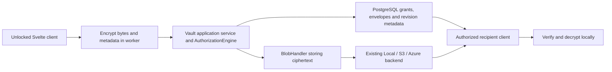

# Vault encrypted files and sharing

**Status: proposal, not implemented.** Reviewed against OxiCloud
`efed8bc67106d4140319a3233278ba0dc71c36f4` on 2026-10-10.

Bring client-encrypted files, metadata, sharing and notes to OxiCloud through
the Vault direction in [AGENTS.md](../../AGENTS.md). Preserve shared drives,
the authorization engine and the existing storage lifecycle. Build this as a
series of reviewable changes; the transport fix and this design do not enable
end-to-end encryption.

## Existing capabilities and the actual gap

OxiCloud already provides local/S3/Azure backends, server-side encryption and
key rotation, chunked and delta transfers, OPAQUE login, DPoP session binding,
grants, public links, collaborative text editing and a recoverable job engine.
Rebuilding these alongside a second storage server would create competing
authorization and lifecycle rules.

The missing property is that file contents and sensitive metadata can remain
unreadable to the OxiCloud server. Today:

- `DriveKind` has `Personal` and `Shared` only. This proposal uses "Vault" for
  an encrypted personal or shared drive, with protection independent of kind.
  That capability is not implemented.
- `EncryptedBlobBackend` holds server-side keys. Its encryption protects
  backend objects at rest, not content from the application server.
- `frontend/src/lib/api/endpoints/opaque.ts::opaqueLogin` uses the completed
  login request but does not expose an application key-unlocking lifecycle.
  OPAQUE authentication alone does not make files encrypted end to end.
- The E2EE v2 layout described in
  [backend-storage.md](../architecture/backend-storage.md#future-end-to-end-encryption)
  is a future format, not proof of an implemented client or routing boundary.
- Server search, previews, EXIF/face extraction, WOPI and collaborative text
  persistence expect readable content. Each needs an explicit Vault policy.

## Proposed Vault capabilities

Implement these capabilities through OxiCloud's existing architecture, using
original code and libraries compatible with its MIT license and dependency
policy. Dependency and cryptographic format choices require separate review.

| Capability | OxiCloud integration |
|---|---|
| Browser encryption, encrypted names and thumbnails | Vault file envelopes; client-only previews; explicit exclusion from server indexing. Keep sensitive names out of paths and logs. |
| OPAQUE login and encrypted private-key storage | Extend OxiCloud's existing auth client with a distinct unlock/recovery lifecycle. Retain OIDC and define how an OIDC user unlocks a Vault. |
| Per-file symmetric encryption and recipient key wrapping | Versioned format with authenticated context, independently generated file revision keys and authenticated recipient identities. Select a compatible implementation after interoperability and security review. |
| Public links with a decryption key in the URL fragment | Reuse token grants and expiry controls; encrypt link metadata and the selected file revision key. Keep the key outside request URLs, analytics and logs. |
| Account sharing, folder sharing and share groups | Reuse User/Group/Token grants. Couple envelopes to membership epochs and enforce revocation during finalization. |
| Concurrent encrypted chunk transfers, optional S3 direct transfer | Bounded requests and memory, authenticated resumable manifests, idempotent finalization. Keep proxy transfer first; consider direct transfer only with verified ciphertext registration and short-lived scoped URLs. |
| Encrypted Markdown notes and file version history | Client editor plus immutable encrypted revisions; reuse file retention and GC accounting. Multi-user access is part of the first usable release. |
| Client-tagged search using keyed tokens | Start with local search over decrypted metadata. An optional keyed index needs a documented leakage model and key-rotation/reindexing plan. |
| TOTP, invitations and admin/session management | MFA is a separate OxiCloud auth contribution; reuse existing invitations, admin controls and SSO. |
| SQLite/PostgreSQL and local/S3 deployment | Retain OxiCloud's PostgreSQL metadata and existing backends. A SQLite port is not an E2EE prerequisite. |

## Threat model and visible metadata

Protect file bytes, filenames, notes, previews and key material from a storage
provider or server operator who can inspect stored data and normal protocol
traffic. Preserve availability and integrity checks already supplied by
OxiCloud. Authenticated encryption must detect changed, reordered, substituted
or truncated content before a download is accepted.

The server still observes accounts, grants, opaque object identifiers,
membership relationships, ciphertext sizes, counts and access timing. Padding
can reduce size disclosure; it cannot make the access pattern invisible.
Keyed search tags additionally reveal repeated searches and match patterns.
Do not describe an indexed mode as leaking nothing.

A server delivering malicious browser JavaScript, XSS, or a compromised
unlocked device can steal plaintext or keys. Browser E2EE does not remove this
trust boundary. A separately distributed/verifiable client improves that
boundary and is a later workstream. Key-directory substitution also requires
identity verification, not merely encryption to whichever key the server sends.
Revocation prevents future authorized access; it cannot erase keys or plaintext
that a recipient already copied.

## Integration boundaries

Use a typed content-protection boundary, enforced in application services.
It must survive folder moves, copies, restored versions, shared access and
every protocol surface. A filename extension, MIME type or mutable policy flag
alone is insufficient to identify protected content.

Keep `DriveKind::{Personal, Shared}` and add a separate typed, persisted
content-protection property, for example `Plain` or `ClientEncrypted` with a
versioned encryption context. Both kinds can then be encrypted. This refines
the reserved Vault-kind wording in `AGENTS.md`; align that guidance when the
model is agreed. Database constraints, domain types, DTOs, OpenAPI and Svelte
types must agree on the property. It is not a freely toggled policy: existing
drives default to plain, and changing protection on populated content requires
an explicit client-mediated migration with verification and crash recovery.

Attach the encryption context to the source drive. Shares and per-recipient
mounts distribute access and key envelopes; they do not redefine the source
content's protection. Moving, copying or linking content must preserve that
context or use the explicit migration path. Cross-drive and per-share encryption
contexts remain separate future designs, not implicit behavior in this release.

Content I/O still uses `BlobHandler`, as required by `src/AGENTS.md`. A Vault
stores an opaque client envelope as content; server-side encryption may wrap
those already-encrypted bytes again. The server hashes ciphertext for storage
integrity and must not require a plaintext hash to register or commit it.

The older OXCPT v2 sketch needs a separate format decision before implementation:
either retain a client envelope inside today's storage framing or implement an
explicit v2 dispatch path with migration tests. Do not reinterpret existing v1
objects or add a passthrough arm without the service-level Vault boundary.

The existing chunk headers provide a format/version and key-fingerprint hook
for rotation. Define separately which fields describe the server's at-rest key
and which identify the client's envelope/epoch; neither a fingerprint nor an
unkeyed chunk hash proves authenticity. Bind client-relevant header fields to
the authenticated envelope and manifest. Reject unknown versions, mismatched
epochs and downgrade attempts. Any header extension needs versioned read/write
vectors and mixed-version rotation tests without rewriting legacy semantics.

Randomized encryption prevents useful cross-user plaintext deduplication.
Never use deterministic encryption or plaintext hash probes to preserve current
dedup ratios. Reuse ciphertext only within an explicitly authorized scope;
negotiate, by-hash creation and chunk-download entitlements need a Vault-aware
review. The current delta download path is owner-scoped, so it is not already
a shared-Vault API.

## Keys, recovery and membership

Define a versioned, canonical envelope and test vectors before writing wire
handlers. Candidate building blocks are standard AEAD, domain-separated KDFs,
and a maintained MIT/Apache-compatible recipient-wrapping implementation such
as an implementation of [HPKE](https://www.rfc-editor.org/rfc/rfc9180.html).
HPKE alone does not supply application replay protection or recipient identity
verification. Algorithm and dependency choices remain review decisions. Use
reviewed standard constructions; do not invent a new cryptographic protocol here.

Required key separations and lifecycle:

1. An account/device identity key authenticates recipient keys and membership
   changes. Key fingerprints and changed-key warnings need a usable verification
   path; a self-signed replacement from the server is not sufficient continuity.
2. Vault membership keys are versioned by epoch. Envelopes address authorized
   recipients/devices. Group membership changes must produce a durable pending
   rotation that an authorized unlocked client can complete; a background server
   job cannot create new client key material.
3. Each file revision gets a fresh random content key. Metadata, chunks and
   previews use separately derived keys or nonce domains. Authenticated context
   includes the format/suite, vault/object/revision identifiers, membership epoch,
   chunk position, lengths and final chunk count.
4. Retries reuse the exact ciphertext for a revision. Re-encrypting changed
   bytes under an old key/nonce is forbidden. A restart restores an encrypted
   resumable manifest or begins a new revision/key.
5. Private keys are wrapped client-side. Local-password users can use a
   domain-separated key derived from the
   [OPAQUE export key](https://www.rfc-editor.org/rfc/rfc9807.html); verify what
   the existing library exposes before selecting this path. Never use session
   keys, JWTs or DPoP keys as encryption keys. OIDC users need a separate unlock
   secret, recovery material or an approved device flow.
6. Recovery material is generated and verified client-side. Password changes
   must atomically rewrap existing keys. Admin password reset does not decrypt
   or silently replace a user's Vault. Explain loss-of-recovery consequences
   before the first write, and prove restore on another device.

Keep unlocked secrets out of localStorage, logs and notification payloads.
Clear in-memory handles on logout, account switch and locking; persist only
appropriately wrapped material. Use the `oxi-` preference namespace for any
non-secret preferences so existing account-switch cleanup works.

## Transfer and commit semantics

Use bounded per-request framing for initial sends and every recovery path.
The current delta-worker recovery fix supplies this for existing uploads; it
does not add encryption or durable cross-restart resume.

For a Vault session, persist an authenticated manifest of ciphertext chunks,
revision ID, intended logical metadata, acknowledged chunks and request ID.
Maintain a bounded queue and concurrency. Retry only safe, idempotent operations
with bounded backoff and cancellation; never silently fall back to plaintext.
Maximum plaintext chunk size must account for AEAD tags and envelope overhead
inside existing server/proxy frame limits.

Treat manifest poisoning as a protocol threat, including substitution of valid
chunks from another object, reordering and replay of an older complete revision.
Require a canonical, versioned manifest authenticated by an authorized writer's
signature (or an explicitly reviewed equivalent construction). Bind the source
drive/encryption context, object and revision IDs, parent revision, membership
epoch, ordered ciphertext hashes and lengths, encrypted-metadata digest, total
length and final marker. Clients verify it against authenticated writer identity
and membership before accepting decrypted content; server-side validation alone
cannot establish E2EE integrity. Signature coverage and key distribution need
independent test vectors and security review.

A valid signature does not establish freshness. Clients must retain or obtain
an authenticated revision/epoch checkpoint and reject rollback or divergent
history according to a defined recovery policy. A new device has no such local
history: bootstrap from a trusted device/recovery checkpoint, or explicitly
document the remaining server-equivocation risk. Include substitution, missing
chunk, duplicate/reordered chunk, unauthorized writer, stale-epoch and rollback
cases in the acceptance suite.

Finalization must recheck authorization, quota, object revision and membership
epoch under one transactional boundary. On a revoked grant or changed epoch,
reject the stale commit without changing the active revision. Publish the new
revision only after all chunks exist and the manifest is verified. A lost
response must be recoverable by request ID without duplicate files or extra
references. Authenticated totals/final markers must make truncation detectable.

Keep write-before-reference and durable deletion intent from
[storage-consistency.md](storage-consistency.md). Pin pending content long enough
for a bounded resume lease, expire abandoned leases, and let canonical GC reclaim
unreferenced chunks. Test crash/restart at each transition. A storage read error
must never be treated as proof that a chunk does not exist.

## Encrypted sharing

Internal sharing requires both an authorization grant and the correct recipient
key envelope. Envelope possession is not server permission, and permission
alone does not imply decryptability. An Owner/Editor cannot add a recipient key
without the corresponding Share permission. Preserve anti-enumeration and
structured audit denial events.

Public links use an independent random link key in a URL fragment. The server
stores encrypted metadata and a wrapped key for the selected revision; token
grants continue to enforce expiry, password policy and revocation. Link password
gates and cryptographic key protection are different properties and must be
described separately. Never publish the Vault master key or a key granting the
entire folder merely to share one file. Define whether a link follows updates
or snapshots a revision before enabling mutable shares.

Read the fragment in the recipient client without sending it to telemetry or
error reporting. Render decrypted Markdown/text as untrusted content. Revoke
future access at the service layer, and rotate content keys for future revisions
after membership removal. Notify clients through existing message-bus topics
using opaque IDs rather than decrypted filenames.

Encrypted collaboration is a target of this design. The first usable release
must support multiple members editing encrypted file revisions with conflict
handling; it must not stop at an owner-only Vault. Live co-editing additionally
needs an encrypted update/snapshot protocol with authenticated writer identities,
ordering/replay protection, membership-epoch rotation and offline merge rules.
Keep the current plaintext CRDT persistence unavailable to encrypted drives
until that protocol is reviewed. Its release gate is two clients editing and
reconnecting concurrently, including member removal, without plaintext updates
or snapshots reaching server storage, logs or backups.

## Feature compatibility

| Surface | Required Vault behavior |
|---|---|
| Web UI | Unlock, local decrypt/preview, visible locked state and recovery workflow. No plaintext upload fallback. |
| Search / OCR / face / EXIF / transcoding jobs | Exclude Vault bytes by typed policy before reading; optional client-produced encrypted derivatives. |
| WOPI and current server-persisted CRDT editing | Refuse until a separately designed encrypted collaboration protocol exists. Client-only note editing can ship earlier. |
| Generic WebDAV and Nextcloud clients | No implied E2EE compatibility. Omit Vault content or return a documented unsupported response; offer it only through a client-aware encrypted protocol. |
| Plain-drive/Vault move or copy | Explicit client-mediated decrypt/encrypt operation with verification; never a metadata-only move that changes the privacy promise. |
| Trash, versions and restore | Preserve encrypted envelopes and key epochs with their content; apply quota/refcount/retention rules to each retained revision. |
| Admin jobs, backup and migration | Inspect/transfer ciphertext and restore envelopes alongside it; never need private keys. Discovery remains non-destructive by default. |
| Federation | Coordinate with PR #669, but keep encryption envelopes above OCM transport. A successful federated share is not proof of encryption interoperability. |

## Proposed contribution sequence and acceptance gates

| PR | Scope | Required evidence |
|---|---|---|
| 1 | Bounded delta recovery, usable independently | Real worker tests for request caps, framing, recovery subset, duplicates, failure and retry limit; frontend checks/build. |
| 2 | This design and correction of the historical storage prompt | Maintainer agreement on threat model, multi-user Vault semantics, formats, recovery and compatible dependencies. No runtime E2EE claim. |
| 3 | Typed drive-protection property and inert feature gate | Personal and shared drive coverage; cross-user/service tests; every REST/DAV/WOPI/index path rejects unsupported access; new migrations sort after current main. No user-created Vault until subsequent gates pass. |
| 4 | Reviewed envelope and signed manifest, account/device keys, unlock and recovery | Independent vectors; manifest poisoning, rollback, altered/truncated/reordered content rejected; wrong keys and changed identity detected; header-version/rotation and password/OIDC/recovery tests. |
| 5 | Ciphertext upload/download and encrypted metadata | Browser round trip on Local and S3; zero plaintext in API traces, DB, logs, temp files or derivatives; interruption/restart/idempotency tests; bounded memory. |
| 6 | Multi-user membership and encrypted public links | Two users and a group; add/remove/role change races; stale-epoch commit denial; link expiry/revoke; recipient decrypt with no server key. PRs 4–6 form the first usable release together. |
| 7 | Notes, immutable versions, encrypted previews and local search | Conflict-safe saves, retention/refcount/restore tests, sanitized rendering, account-switch cleanup. |
| 8 | Optional searchable tags, direct S3, offline clients and federation | Separate leakage/permission model, protocol compatibility and failure-injection tests. |
| 9 | Encrypted live collaboration | Reviewed update/snapshot protocol; two-client concurrent edits and offline reconnect; replay/rollback and revoked-member rejection; no server-readable CRDT state. Can proceed alongside PRs 7–8 once the shared key lifecycle is stable. |

MFA, scheduled consistency checks and ordinary file versioning are valuable
parallel contribution areas, but none alone supplies Vault E2EE. Do not mark
the E2EE roadmap complete when only an enum, crypto helper or design has landed.

Backend contributions follow root/src `AGENTS.md`: application-layer authz,
OpenAPI registration/regeneration, formatting, Clippy and the prescribed local
unit/integration/Hurl checks. Frontend contributions use Svelte 5/TypeScript,
the existing API client and shared logging, with `npm run check`, unit tests and
a production build. Browser/network privacy tests are additional release gates,
not replaced by mocked crypto tests.
